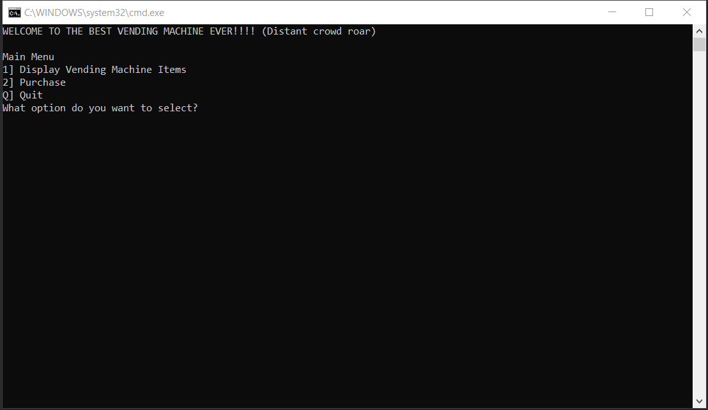

# Vending Machine
A simple C# command line program demonstrating OOP.

## Class: Menu (provided)

## Class: VendingMachine (the controller)
1. Handles the Display class (which calls the Menu Class)
2. Gets the stuff from the inventory file
3. Creates the VendingItems Objects (adds them to a list)
4. Updates the VendingItems Objects' inventory when something is vended
5. Has Money from that class
6. Uses the logger to log the transactions

Basically it uses all of the other classes...

## Abstract class: VendingItem
- Slot Location
- Product name
- Price
- Type
- Stock
- Message when vended

## Each food type is a class that inherits from VendingItem:
- chips
- candy
- drinks
- gum

## Class: Money
- Tracks money fed into the system
- Has a method that calculates change/coins based on values it's given

## Class: Logger
- Every time an action is taken, the logger class is called
- Has two different types of logs:
    + Purchase Log (money coming in and out)
    + Sales Report

## Class: File Handler
- A wrapper for StreamReader and vending-machine.gif
[vending machine CLI]: 
